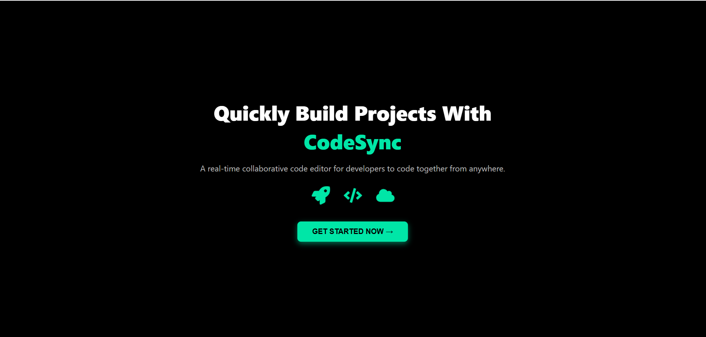
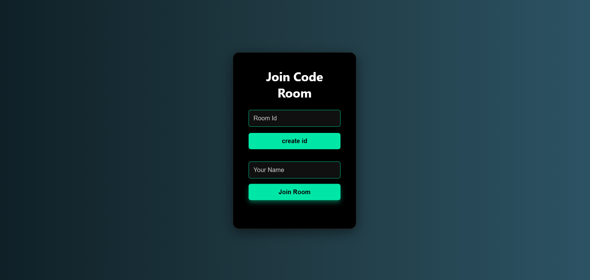
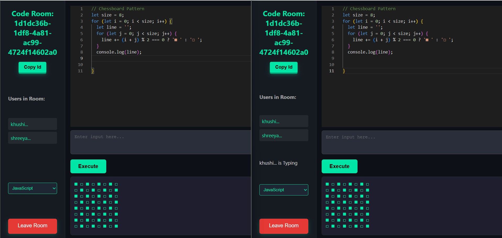

# 🚀 CodeSync - Where Coders Jam Together! 

Tired of coding alone? **CodeSync** is your virtual coding dojo where developers can pair-program in real-time, no matter where they are! It's like Google Docs, but for code, and way cooler (if we do say so ourselves 😎).

## ✨ Why You'll Love It

| Feature | Emoji | Why It's Awesome |
|---------|-------|------------------|
| **Real-time collab** | 👯‍♂️ | Code together like you're sitting side-by-side |
| **4 Languages** | 🐍☕️🟨➕ | Python, Java, JavaScript & C++ - take your pick! |
| **Live Presence** | 👀 | See who's typing (no more awkward "hello?") |
| **Code Execution** | ⚡️ | Run code without leaving the editor - magic! |
| **Room System** | 🔑 | Your secret clubhouse for coding |
| **Dark Mode** | 🌚 | Because light mode is for monsters |

## 🧰 Under the Hood

**Frontend:**  
 React |  Monaco Editor (VS Code's brain) |  Socket.io-client | UUID  

**Backend:**  
 Node.js |  Express |  Socket.io  

